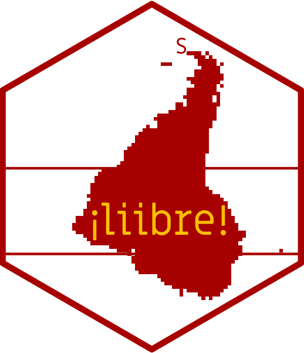

# Nosso logo

O logo de <strong style="color: #a70000; opacity: 0.80;">¡liibre!</strong>
 - Laboratório Independente de Informática da Biodiversidade e Reprodutibilidade em Ecologia - é inspirado na obra America Invertida do uruguaio Joaquín Torres García (1874—1949). 

Acreditamos em uma américa latina ¡libre! sendo feminista, anti-racista, anti-capitalista.

O logo foi criado usando o pacote de R [__hexSticker__](https://github.com/GuangchuangYu/hexSticker) com fonte [Miriam Libre](https://fonts.google.com/specimen/Miriam+Libre). 

